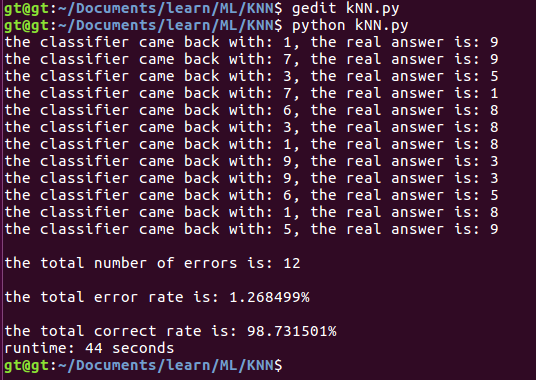
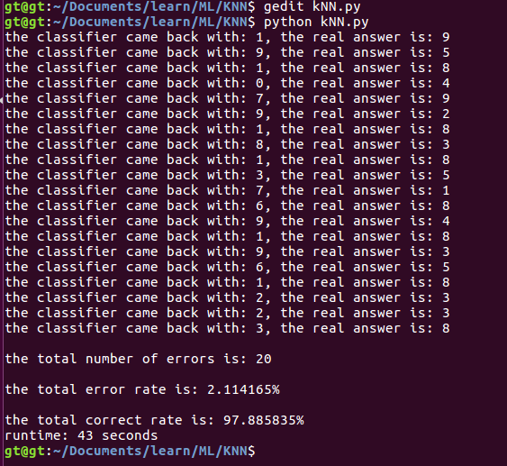
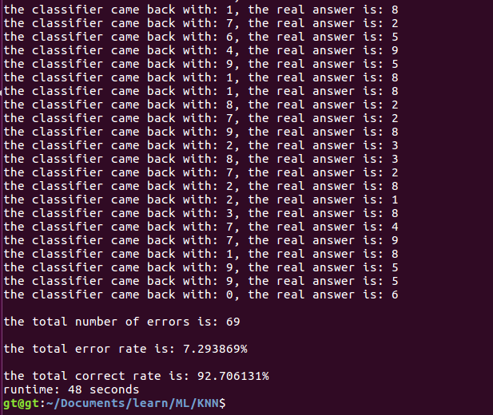
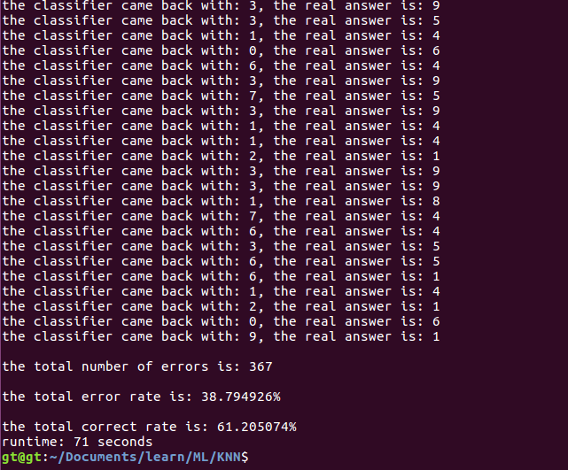
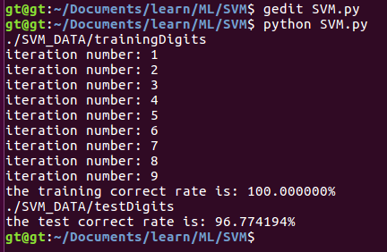

# Machine Learning in Action
This projects are my practices of the book---*machine learning in action*.It includes KNN and SVM algorithm,which resolve the handwriting test problem.Besides,it also includes CNN algorithm.Although CNN is not in the book,it resolves the handwriting problem in another perspective.

*本项目是我对《机器学习实战》一书中部分内容的练习。主要包括了KNN算法和SVM算法,用于解决手写数字识别问题。除此之外，还包括了CNN算法，虽然该算法没有在书中出现，但是也为手写数字识别问题提供了另一种角度。*

## KNN
k-NN is a type of instance-based learning, or lazy learning, where the function is only approximated locally and all computation is deferred until classification. The k-NN algorithm is among the simplest of all machine learning algorithms.

It can be seen from the following running results that the value of the parameter K has a great influence on the accuracy.

*K-NN是一种基于实例的学习，或者是局部近似和将所有计算推迟到分类之后的惰性学习。k-近邻算法是所有的机器学习算法中最简单的之一。*

从如下的运行结果可以看出，当参数k取不同值时，分类结果有显著不同。
### k=3

### k=10

### k=100

### k=1000

## SVM
>In machine learning, support vector machines are supervised learning models with associated learning algorithms that analyze data used for classification and regression analysis. Given a set of training examples, each marked as belonging to one or the other of two categories, an SVM training algorithm builds a model that assigns new examples to one category or the other, making it a non-probabilistic binary linear classifier (although methods such as Platt scaling exist to use SVM in a probabilistic classification setting). An SVM model is a representation of the examples as points in space, mapped so that the examples of the separate categories are divided by a clear gap that is as wide as possible. New examples are then mapped into that same space and predicted to belong to a category based on which side of the gap they fall.

>*在机器学习中，支持向量机是在分类与回归分析中分析数据的监督式学习模型与相关的学习算法。给定一组训练实例，每个训练实例被标记为属于两个类别中的一个或另一个，SVM训练算法建立一个将新的实例分配给两个类别之一的模型，使其成为非概率二元线性分类器。SVM模型是将实例表示为空间中的点，这样映射就使得单独类别的实例被尽可能宽的明显的间隔分开。然后，将新的实例映射到同一空间，并基于它们落在间隔的哪一侧来预测所属类别。*

### result

